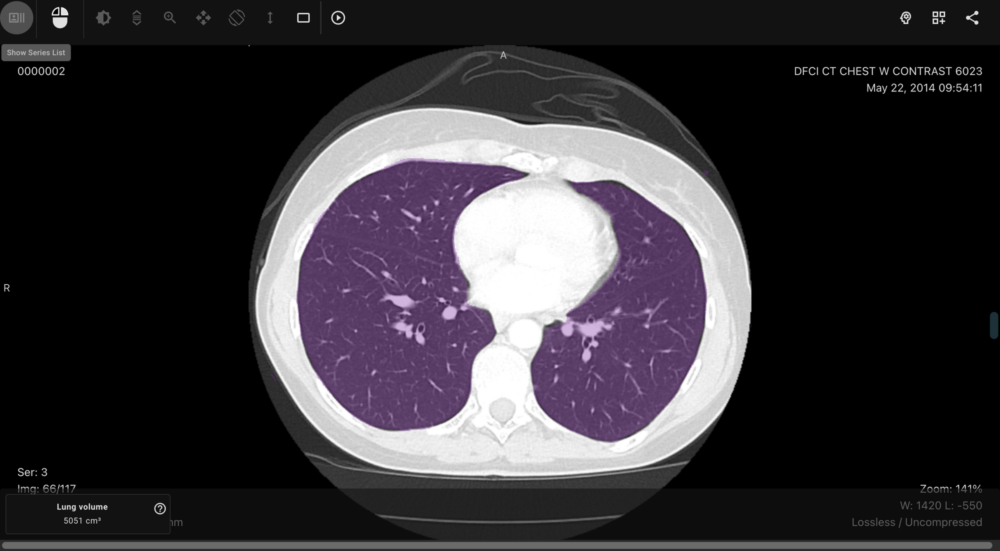
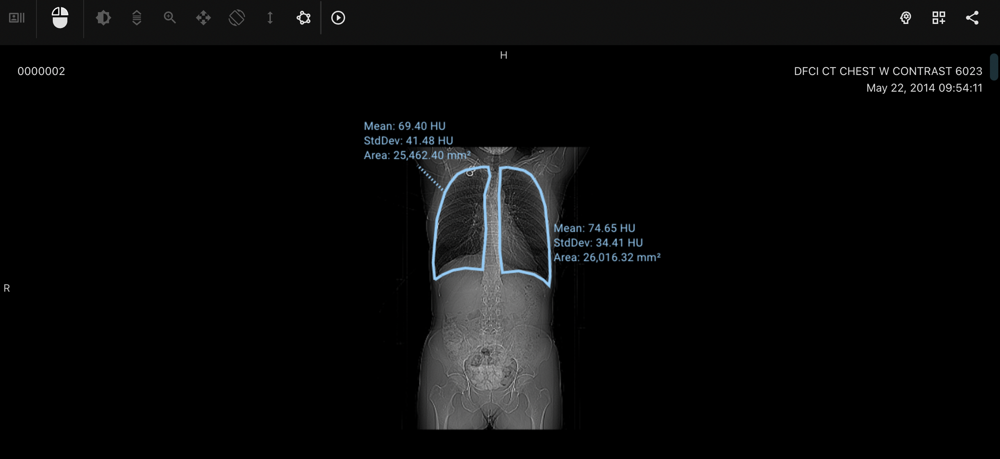

## Medical image viewer

At zhiva, we are working on a medical image viewer that is optimized to be extended with artificial intelligence models. AI predictions can be overlaid directly onto medical images. This allows the AI model to point out important parts of the image, such as pathologies or lesions, to the radiologist viewing the study. We also support extending the prediction with the metadata specific to a study or a series. These will be added to the image, providing the radiologist with additional context.

Beyond our AI superpowers, the viewer has all the standard soft-copy imaging tools, and all routine post-processing capabilities that radiologists are used to. We are also actively developing advanced visualization tools, such as multiplanar reconstruction.

The viewer can be extended by any third-party AI models. We prepared a technical documentation for developers, available at [https://docs.zhiva.org/](https://docs.zhiva.org/). We support common formats and standards to enable interoperability. Zhiva’s viewer works well with formats such as DICOM SEG, JSON, and more. We also provide several customization options for AI vendors, by allowing them to tailor the way AI predictions and displayed in the viewer.