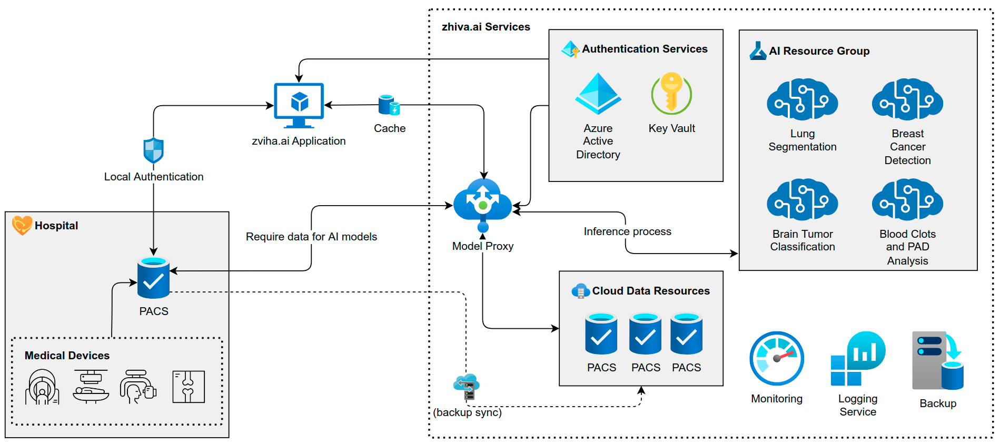

## Flexible integration of AI models

In recent years, many research groups and start-ups created a variety of AI models, but integrating and maintaining multiple single-task solutions does not scale well. It puts a strain on hospitals’ IT and requires radiologists to get used to new interfaces every time a new AI model is integrated. At zhiva, we know that this is not sustainable in the long term, and our platform solves this. We provide a structural framework for hospitals to expand the range of artificial intelligence software they use.

Zhiva enables your hospital to easily integrate groundbreaking AI solutions into your clinical workflow. We consolidate multiple AI solutions into a single, easy-to-use platform. Our medical image viewer can be easily extended with any third-party AI model, and we offer a suite of these solutions out-of-the-box for hospitals. AI systems available within our platform solve many tasks: they can predict, detect and classify. Zhiva is also easily customizable and can be tailored to specific clinical needs. Our platform can be deployed either as a cloud service or locally, depending on your hospital's policies.